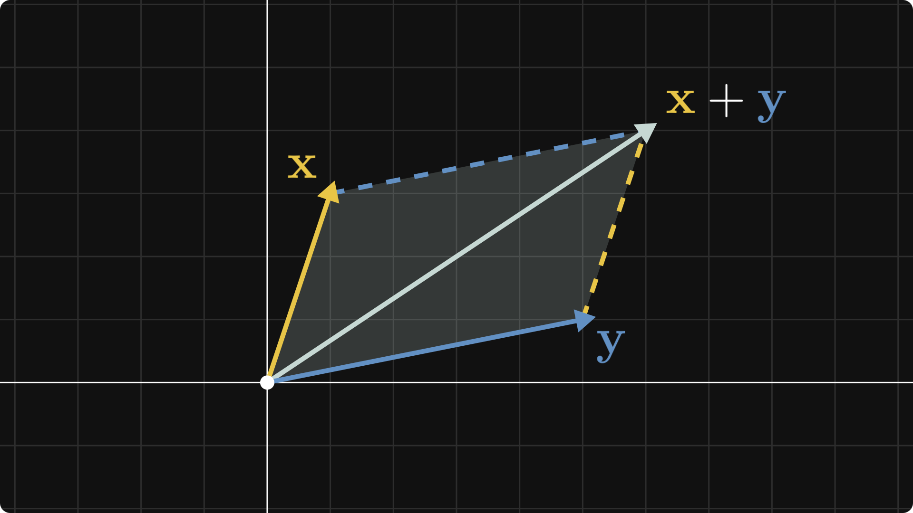

```{latex-preamble}
\usepackage{amsmath}
\usepackage{xcolor}
\definecolor{maizeCrayola}{HTML}{E8C547}
\definecolor{blueGray}{HTML}{6290C3}
```

# Publishing a Technical Memo from Quarto

This example mirrors the Markdown walkthrough, but it uses Quarto-native chunk syntax and options. It demonstrates front matter, `#|` option mapping, arbitrary tags, precomputed `{output}` chunks, and publication-style code blocks.



## Inline Math and Display Math

Inline math such as $\alpha + \beta = \gamma$ stays readable in the final article.

```latex
x = \frac{-b \pm \sqrt{b^2 - 4ac}}{2a} \label{eq:quadratic}
```

$$x = \frac{-b \pm \sqrt{b^2 - 4ac}}{2a} \label{eq:quadratic}$$

Equation \eqref{eq:quadratic} is a good example of why document-wide labels matter.

## Lists and Tables

- Quarto prose becomes notebook markdown cells.
- Chunk options become cell tags.
- Tables can stay native or render as images.

| Target | Typical image mode | Good first choice |
| --- | --- | --- |
| `substack` | embed | long-form essays |
| `medium` | copyable | publication workflows |
| `x` | copyable | short technical posts |

## Executed Code

```{python}
def fibonacci(n):
    """Yield the first n Fibonacci numbers."""
    a, b = 0, 1
    for _ in range(n):
        yield a
        a, b = b, a + b


print("First ten Fibonacci numbers:")
print(*fibonacci(10))
```

## Rich HTML and SVG Outputs

```{python}
from IPython.display import HTML, SVG, display

display(HTML(
    "<div style='padding:0.75rem;border:1px solid #dbe4ee;border-radius:12px;'>"
    "<strong>Rich HTML output</strong> also makes the trip."
    "</div>"
))

display(SVG(
    "<svg xmlns='http://www.w3.org/2000/svg' width='220' height='70'>"
    "<rect width='220' height='70' rx='12' fill='#e0f2fe' />"
    "<text x='16' y='43' font-size='24' fill='#0369a1'>SVG output</text>"
    "</svg>"
))
```

## Quarto Option Mapping

The next cell uses `#| echo: false`, so the exported article shows only the output.

```{python}
#| echo: false
result = sum(i ** 2 for i in range(1, 11))
print(f"Sum of squares from 1 to 10 = {result}")
```

The next cell uses `#| output: false`, so the exported article keeps the source but hides the output.

```{python}
#| output: false
import sys
print(f"Running on Python {sys.version.split()[0]}")
```

The next cell uses an arbitrary tag. `text-snippet` renders it as copyable HTML text instead of an image.

```{bash}
#| tags: [text-snippet]
pip install nb2wb
nb2wb examples/quarto.qmd -t x
```

The next cell uses `#| include: false`, so it stays available in the source but disappears from the final article.

```{python}
#| include: false
draft_only = "This cell is hidden from published output."
print(draft_only)
```

## Precomputed Output Chunks

`{output}` chunks attach stdout to the immediately preceding code chunk. This works even when you do not execute the document during conversion.

```{python}
steps = ["audit", "refine", "publish"]
for step in steps:
    print(step.title())
```
```{output}
Audit
Refine
Publish
```

## Figures in Context

```{python}
import matplotlib.pyplot as plt

with plt.style.context("seaborn-v0_8-white"):
    x = [value / 20 for value in range(-20, 21)]
    y = [value ** 2 for value in x]
    fig = plt.figure(figsize=(8, 4.5))
    plt.plot(x, y, color="#0f766e", linewidth=3)
    plt.title("A simple parabola")
    plt.tight_layout()
    plt.show()
```
